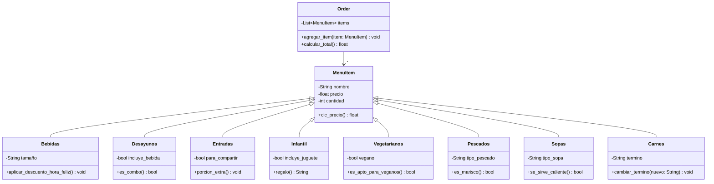
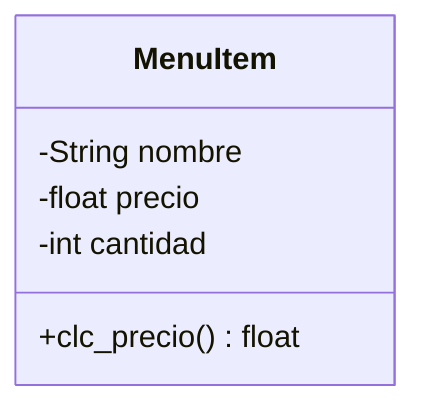
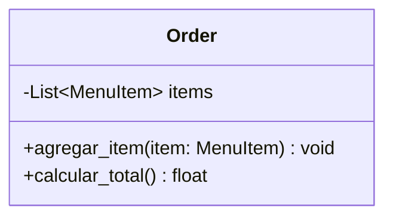

```mermaid
classDiagram
    direction TB
 class Bebidas {
        -String tamaño
        +aplicar_descuento_hora_feliz() void
    }

    class Desayunos {
        -bool incluye_bebida
        +es_combo() bool
    }

    class Entradas {
        -bool para_compartir
        +porcion_extra() void
    }

    class Infantil {
        -bool incluye_juguete
        +regalo() String
    }

    class Vegetarianos {
        -bool vegano
        +es_apto_para_veganos() bool
    }

    class Pescados {
        -String tipo_pescado
        +es_marisco() bool
    }

    class Sopas {
        -String tipo_sopa
        +se_sirve_caliente() bool
    }

    class Carnes {
        -String termino
        +cambiar_termino(nuevo: String) void
    }
    
```

# POO-R3
## Logo del grupo

## Restaurante
Se aborda a traves de clases y herencias de esta el funcionamiento de un restaurante, con menus de comidas y ordenes de clientes.
### Diagrama UML

### Estructura del codigo
#### Menú Item
```python
class MenuItem:
    def __init__(self, nombre, precio, cantidad):
        self.nombre = nombre
        self.precio = precio
        self.cantidad = cantidad

    def clc_precio(self):
        return self.precio * self.cantidad

```

#### Order 
```python
class Order:
    def __init__(self):
        self.items = []

    def agregar_item(self, item):
        self.items.append(item)

    def calcular_total(self):
        total = 0
        for item in self.items:
            subtotal = item.clc_precio()
            if item.cantidad > 3:
                subtotal *= 0.95
            total += subtotal
        if total > 50000:
            total *= 0.85
        return total


if __name__ == '__main__':
    pedido = Order()
    pedido.agregar_item(Bebidas("Jugo", 3000, 2, "grande"))
    pedido.agregar_item(Desayunos("Huevos revueltos", 4500, 1, incluye_bebida=True))
    pedido.agregar_item(Entradas("Pan de ajo", 4000, 2, para_compartir=True))
    pedido.agregar_item(Infantil("Nuggets de pollo", 6000, 1, incluye_juguete=True))
    pedido.agregar_item(Vegetarianos("Ensalada verde", 7000, 1, vegano=True))
    pedido.agregar_item(Carnes("Churrasco", 25000, 1, termino="bien asado"))

    for item in pedido.items:
        print(f"{item.nombre} x{item.cantidad} -> ${item.clc_precio()}")

    print("Total:", pedido.calcular_total())

```



#### Herencias
##### Bebidas, Desayunos, Entradas, Infantil, Vegetarianos, Carnes

```python
class Bebidas(MenuItem):
    def __init__(self, nombre, precio, cantidad, tamaño="mediano"):
        super().__init__(nombre, precio, cantidad)
        self.tamaño = tamaño

    def aplicar_descuento_hora_feliz(self):
        self.precio *= 0.8


class Desayunos(MenuItem):
    def __init__(self, nombre, precio, cantidad, incluye_bebida=True):
        super().__init__(nombre, precio, cantidad)
        self.incluye_bebida = incluye_bebida

    def es_combo(self):
        return self.incluye_bebida


class Entradas(MenuItem):
    def __init__(self, nombre, precio, cantidad, para_compartir=False):
        super().__init__(nombre, precio, cantidad)
        self.para_compartir = para_compartir

    def porcion_extra(self):
        self.cantidad += 1


class Infantil(MenuItem):
    def __init__(self, nombre, precio, cantidad, incluye_juguete=True):
        super().__init__(nombre, precio, cantidad)
        self.incluye_juguete = incluye_juguete

    def regalo(self):
        return "Juguete sorpresa" if self.incluye_juguete else "Sin juguete"


class Vegetarianos(MenuItem):
    def __init__(self, nombre, precio, cantidad, vegano=False):
        super().__init__(nombre, precio, cantidad)
        self.vegano = vegano

    def es_apto_para_veganos(self):
        return self.vegano


class Pescados(MenuItem):
    def __init__(self, nombre, precio, cantidad, tipo_pescado="Tilapia"):
        super().__init__(nombre, precio, cantidad)
        self.tipo_pescado = tipo_pescado

    def es_marisco(self):
        return self.tipo_pescado.lower() in ["camarón", "langosta", "pulpo"]


class Sopas(MenuItem):
    def __init__(self, nombre, precio, cantidad, tipo_sopa="caldo"):
        super().__init__(nombre, precio, cantidad)
        self.tipo_sopa = tipo_sopa

    def se_sirve_caliente(self):
        return self.tipo_sopa.lower() != "fría"


class Carnes(MenuItem):
    def __init__(self, nombre, precio, cantidad, termino="medio"):
        super().__init__(nombre, precio, cantidad)
        self.termino = termino

    def cambiar_termino(self, nuevo_termino):
        self.termino = nuevo_termino

```

